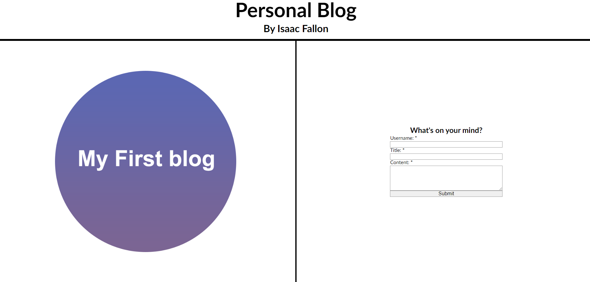

# Coding Bootcamp Challenge 4 - Personal Blog by Isaac Fallon

## Description

This project is a personal blog application built using HTML, CSS and Javascript. It serves as the week 4 challenge for the University of Sydney's Coding Bootcamp.

### Screenshot of deployed application (Blog form entry page):

### Screenshot of deployed application (Blog entries page - light mode):

.png)

### Screenshot of deployed application (Blog entries page - dark mode):

.png)

- My motivation to complete this project was so that I could have a way to input blog entries and keep them in local storage. 
- I build this project so I could have a more elegant way of tracking blog entries.
- This app solves the problem of not having a way to easily save blog entries online. 
- By completing this challenge, I learned a lot about how local storage works and how powerful it can be as a tool; whether that's storing complex data or just making the user's life easier by saving some inputs. 

## Usage

If you want to access the application easily, [visit the working GitHub Pages link here](https://isaacfallon.github.io/4-Challenge-Personal-Blog/) or by accessing the full link:
https://isaacfallon.github.io/4-Challenge-Personal-Blog/

Alternatively, you can also clone the repository and run the project locally. [Refer to this guide from GitHub if you need help.](https://docs.github.com/en/repositories/creating-and-managing-repositories/cloning-a-repository/)

## Credits

For the buttons used in my project, I took inspiration from the [W3 Schools CSS Button styling guide.](https://www.w3schools.com/css/css3_buttons.asp) While I took their code as inspiration, I changed it up enough that I'm confident it's my own work.

## License

MIT License

Copyright (c) 2024 isaacfallon

Permission is hereby granted, free of charge, to any person obtaining a copy
of this software and associated documentation files (the "Software"), to deal
in the Software without restriction, including without limitation the rights
to use, copy, modify, merge, publish, distribute, sublicense, and/or sell
copies of the Software, and to permit persons to whom the Software is
furnished to do so, subject to the following conditions:

The above copyright notice and this permission notice shall be included in all
copies or substantial portions of the Software.

THE SOFTWARE IS PROVIDED "AS IS", WITHOUT WARRANTY OF ANY KIND, EXPRESS OR
IMPLIED, INCLUDING BUT NOT LIMITED TO THE WARRANTIES OF MERCHANTABILITY,
FITNESS FOR A PARTICULAR PURPOSE AND NONINFRINGEMENT. IN NO EVENT SHALL THE
AUTHORS OR COPYRIGHT HOLDERS BE LIABLE FOR ANY CLAIM, DAMAGES OR OTHER
LIABILITY, WHETHER IN AN ACTION OF CONTRACT, TORT OR OTHERWISE, ARISING FROM,
OUT OF OR IN CONNECTION WITH THE SOFTWARE OR THE USE OR OTHER DEALINGS IN THE
SOFTWARE.